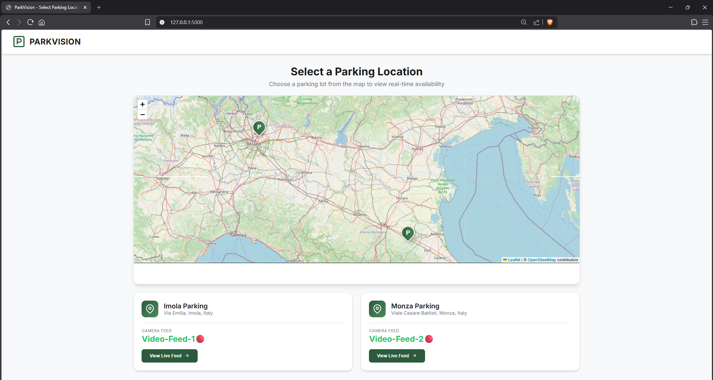
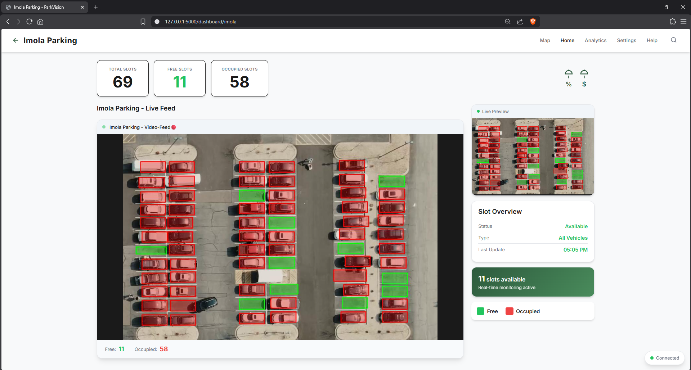
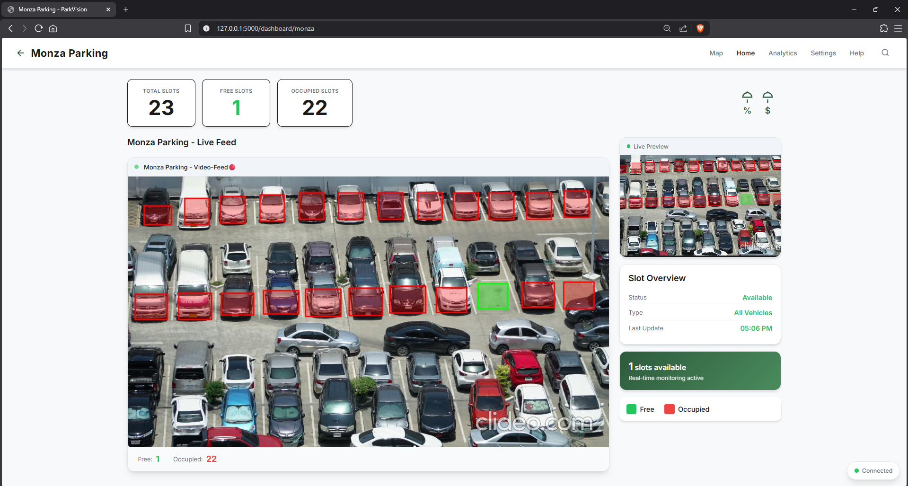

# 🚗 ParkVision

A computer vision-based smart parking lot monitoring system that detects and tracks parking slot occupancy in real-time using OpenCV.


## ✨ Features

- **Real-time Parking Detection** - Analyzes video feeds to detect occupied and free parking slots
- **Visual Slot Marker Tool** - Interactive tool to define parking slot boundaries
- **Edge & Pixel Analysis** - Uses Canny edge detection and color variance to determine occupancy
- **REST API** - FastAPI endpoint to query parking status programmatically
- **Live Statistics** - Displays real-time count of free and occupied slots
- **Web Dashboard** - Real-time web interface with Flask & SocketIO

## 📁 Project Structure

```
ParkVision/
├── src/                       # Core Python scripts
│   ├── parking_analyzer.py    # Main detection script
│   ├── slot_marker.py         # Interactive slot marking tool
│   └── api.py                 # FastAPI REST endpoint
├── config/                    # Configuration files
│   ├── parking_slots.json     # Slot coordinates (camera 1)
│   └── parking_slots2.json    # Slot coordinates (camera 2)
├── videos/                    # Video files (not tracked in git)
│   ├── carPark.mp4
│   └── 2.mp4
├── web/                       # Flask web application
│   ├── app.py                 # Main Flask app with SocketIO
│   ├── static/                # CSS and JavaScript
│   └── templates/             # HTML templates
├── screenshots/               # Project screenshots
├── requirements.txt           # Python dependencies
├── LICENSE                    # MIT License
└── README.md
```

## 🚀 Getting Started

### Prerequisites

- Python 3.8 or higher
- A parking lot video file (e.g., `carPark.mp4`)

### Installation

1. **Clone the repository**
   ```bash
   git clone https://github.com/MathewX470/ParkVision.git
   cd ParkVision
   ```

2. **Create a virtual environment** (recommended)
   ```bash
   python -m venv venv
   
   # Windows
   venv\Scripts\activate
   
   # Linux/macOS
   source venv/bin/activate
   ```

3. **Install dependencies**
   ```bash
   pip install -r requirements.txt
   ```

## 📖 Usage

### Step 1: Mark Parking Slots

Before analyzing a video, you need to define the parking slot boundaries:

```bash
python src/slot_marker.py
```

**Controls:**
| Key | Action |
|-----|--------|
| **Drag** | Draw a rectangle to create a slot |
| **F** | Duplicate the last slot |
| **W/S** | Adjust vertical offset |
| **A/D** | Adjust horizontal offset |
| **U** | Undo last slot |
| **P** | Save and exit |

The slot coordinates are saved to `config/parking_slots.json`.

### Step 2: Run the Parking Analyzer

Analyze a parking lot video to detect occupancy:

```bash
python src/parking_analyzer.py
```

- **Green slots** = Free 🟢
- **Red slots** = Occupied 🔴
- Press **ESC** to exit

### Step 3: Run the Web Dashboard

Start the Flask web server with real-time updates:

```bash
python web/app.py
```

Access the dashboard at: `http://localhost:5000`

### Step 4: Query via API (Optional)

Start the FastAPI server to get parking status via REST:

```bash
uvicorn src.api:app --reload
```

Access the API at: `http://localhost:8000/parking/status`

**Example Response:**
```json
{
  "total_slots": 15,
  "free": 5,
  "occupied": 10
}
```

## ⚙️ How It Works

ParkVision uses a pixel-based analysis approach to determine slot occupancy:

1. **Edge Detection** - Applies Canny edge detection to identify car outlines
2. **Color Variance** - Calculates standard deviation of pixel values
3. **Threshold Comparison** - Empty slots (asphalt) have low edge density and uniform color, while occupied slots (cars) show high edge density and varied colors

```python
# Detection thresholds (adjustable)
edge_threshold = 8      # Edge density percentage
std_threshold = 35      # Color variance threshold
```

## 🎛️ Configuration

You can tune the detection sensitivity by modifying these parameters in `parking_analyzer.py`:

| Parameter | Default | Description |
|-----------|---------|-------------|
| `edge_threshold` | 8 | Minimum edge density % to consider occupied |
| `std_threshold` | 35 | Minimum color std dev to consider occupied |

## 📸 Screenshots

### Interactive Map


### Slot Detection View 1


### Slot Detection View 2


## 🛠️ Tech Stack

- **OpenCV** - Computer vision and image processing
- **NumPy** - Numerical operations
- **FastAPI** - REST API framework
- **Flask-SocketIO** - Real-time WebSocket support (optional)

## 🤝 Contributing

Contributions are welcome! Feel free to:

1. Fork the repository
2. Create a feature branch (`git checkout -b feature/amazing-feature`)
3. Commit your changes (`git commit -m 'Add amazing feature'`)
4. Push to the branch (`git push origin feature/amazing-feature`)
5. Open a Pull Request

## 📄 License

This project is licensed under the MIT License - see the [LICENSE](LICENSE) file for details.